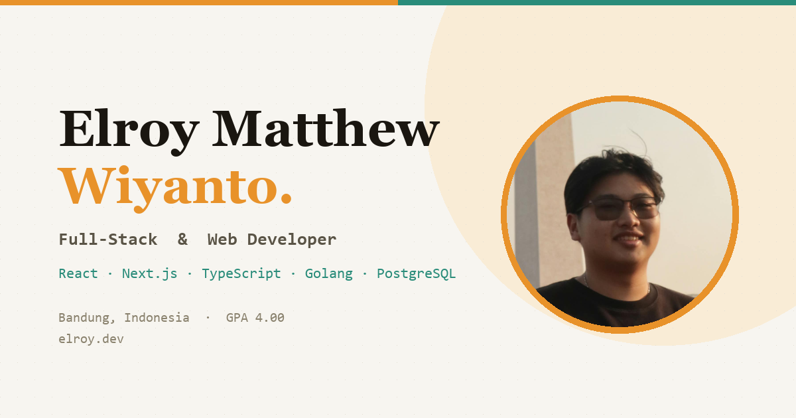

# Responsive Portfolio Website Patrick
## [Watch it on youtube](https://youtu.be/Y4-xMb-eHOQ)
### Responsive Portfolio Website Patrick

- Responsive Portfolio Website Design Using HTML CSS & JavaScript
- Contains animations when scrolling.
- Smooth scrolling in each section.
- Contains a beautiful dark theme.
- The color of the project can be customized.
- Sending emails in the contact section.
- Developed first with the Mobile First methodology, then for desktop.
- Compatible with all mobile devices and with a beautiful and pleasant user interface.

💙 Join the channel to see more videos like this. [Bedimcode](https://www.youtube.com/@Bedimcode)

## AI Assistant

Widget chat di pojok kanan bawah menjawab pertanyaan tentang Elroy — pengalaman,
project, keahlian, ketersediaan. Ditenagai Claude lewat sebuah serverless function.

### Struktur

| File | Isi |
|---|---|
| `api/profile.js` | Basis pengetahuan + prompt sistem. **Satu-satunya file yang perlu diubah** saat ada pekerjaan/project/sertifikat baru. |
| `api/chat.js` | Serverless function: memegang kunci API, memanggil Claude, streaming SSE ke browser. |

Kunci API tidak pernah dikirim ke browser. Kalau ditaruh di JavaScript sisi klien,
siapa pun bisa membacanya lewat View Source.

### Setup

1. Ambil kunci API di https://console.anthropic.com → API Keys
2. Vercel → project → Settings → Environment Variables → tambah `ANTHROPIC_API_KEY`
3. Redeploy

Untuk dev lokal: `npm install`, buat file `.env` berisi `ANTHROPIC_API_KEY=...`
(sudah masuk `.gitignore`), lalu `npx vercel dev`.

Preview statis biasa (`python -m http.server`) tidak menjalankan serverless
function — widget-nya akan bilang asisten cuma aktif di versi ter-deploy. Itu
normal.

### Batasan yang sudah dipasang

- Maks 8 pertanyaan per menit per IP (per-instance, menahan spam kasar — bukan
  plafon keras; untuk itu pakai Upstash Redis atau Vercel Firewall)
- Maks 800 karakter per pertanyaan, 10 pesan riwayat terakhir
- `max_tokens` 1200, effort `low` — jawaban chat pendek, biaya per pertanyaan terkendali
- Prompt sistem di-cache, jadi profil yang ~2.500 token tidak dibayar penuh tiap
  pertanyaan. Pantau lewat `cache_read` di event `done`.
